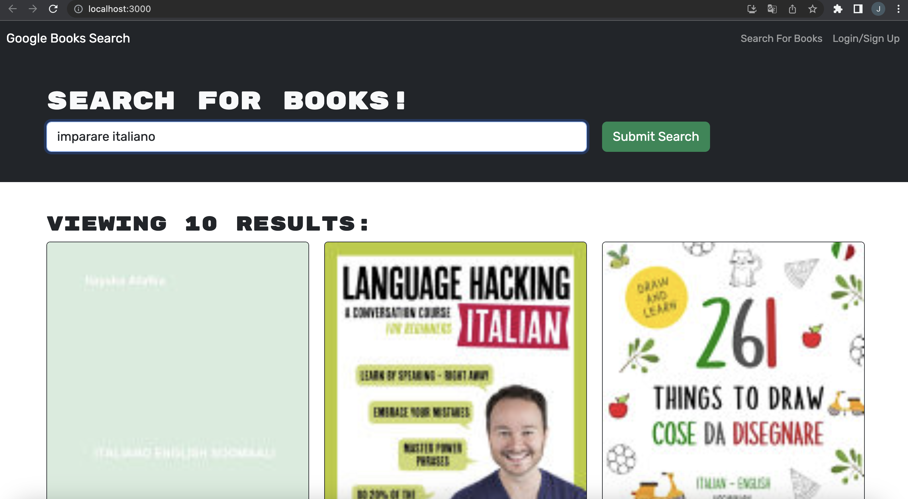
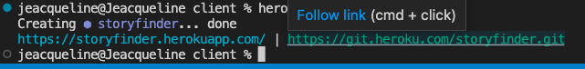

# Stories

This application is a book search tool that allows you to search and discover books according to your interests. You can search by title, author or keywords, and get detailed information about the books found.

Resources for the development of this app:
21-MERN/01-activities/25,22,28

## Technologies used
- React.js: JavaScript library used to build the user interface of the application.
- Node.js: JavaScript runtime environment used for server development and package management.
- Express.js: Node.js framework used to create the server and define the API routes.
- MongoDB: NoSQL database used to store the book information.
- Mongoose: MongoDB object modeling library used to interact with the database from the application.

## Installation
Follow these steps to install and run the application in your local environment:

- Clone the repository: git clone https://github.com/Jeacqueline/Stories.git
- Go to the project directory: cd stories
- Install the dependencies: npm install
- Start the server: npm start
- Open your web browser and visit http://localhost:3000 to access the application.

## Usability
- On the home page, you will find a search field where you can enter the title, author or keywords related to the book you are looking for.
- Click on the "Search" button or press Enter to perform the search.
- A list of books matching your search query will be displayed.
- Click on a book in the list to see more details, such as title, author, description and cover.
- If you wish to save a book to your favorites list, click the "Save" button.
- You can access your favorites list by clicking on the "Favorites" section in the top navigation bar.
- From the favorites list, you can view your saved books and delete those you are no longer interested in.

[GitHub/Jeacqueline Stories](https://github.com/Jeacqueline/Stories)

[Heroku/Jeacqueline storyfinder](https://storyfinder.herokuapp.com/)
